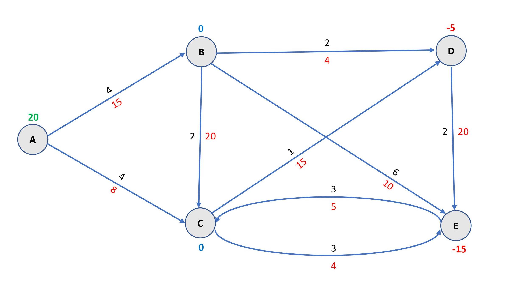

# Min-Cost-Network-Flow-Lemon
A Simple C++ Implementation of the Lemon Optimization Library to Solve a Minimum Cost Flow problem in a given Graph Network with Supply/Demand Values of Nodes and Capacity, Unit Cost of Flow for each Edge.  

## Prerequisite
### Lemon C++ Library
[Download](https://lemon.cs.elte.hu/trac/lemon/wiki/Downloads) the Lemon C++ Graph and Optimization Library. Follow the [instructions](https://lemon.cs.elte.hu/trac/lemon/wiki/InstallGuide) to build and install the library on your programming environment.

## Problem Definition
A minimum cost flow problem is where a real-world network of physical locations is represented by a Graph in the following manner : 
* **Nodes** - represent each physical location associated with a certain amount of Supply (+ve value) or Demand (-ve value)
* **Edges** -  Connects nodes as per per available routes for real-world resource transfer. Each edge is associated with a certain max capacity of transfer and a cost of transfer per unit of resource

**For the purpose of demonstration we have used a simple problem illustrated on the Google OR Tools webpage found [here](https://developers.google.com/optimization/flow/mincostflow) :**

In the above figure :
* The no. on each Node represents the Supply/Demand value at each location.
* The black no. on each Edge represents the cost of transfer of resources per unit.
* The red no. underneath each Edge represents the maximum flow capacity.

**The problem data has been recorded as per requirement in .csv format to be read by the program.** 

## Objective
Return a list of optimal flows for each edge in the directed graph to minimize the gap between the supply and demand at the minimum attainable transfer cost. 
